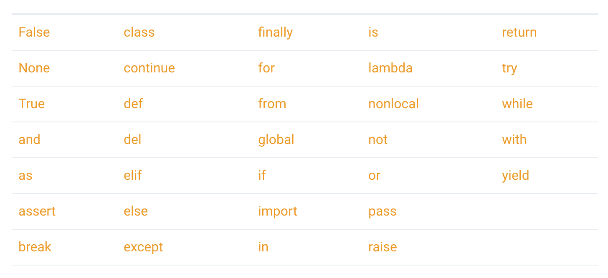

Wiesz już, czym operacje arytmetyczne i wyrażenia logiczne.

A co w sytuacji, kiedy jeszcze nie znamy danej wartości, a i tak chcemy jej użyć? Albo jeżeli będzie się ona zmieniać? W takiej sytuacji przydadzą się nam zmienne.

Zmienne to służą do przechowywania danych. Możesz wyobrażać je sobie jako opisane pudełka, do których wsadzać różne dane i później możesz z nich korzystać odwołując się do nazwy określonego pudełka

Każda zmienna ma nazwę, wartość oraz miejsce przechowywania w pamięci komputera.

Spórz na przykład przypisania wartości do zmiennej:

```
>>> sentence = "Hello world"
>>> print(sentence)
Hello world
```

Stworzyliśmy w ten sposób nową zmienną o nazwie `sentence`.

Kiedy otoczymy jakieś znaki cudzysłowem, tworzymy daną typu **string**, czyli po prostu ciąg liter, liczb czy innych znaków.


**Zasady tworzenia nazw zmiennych:**

1. Pierwszym znakiem musi być litera alfabetu lub podkreślenie
2. Nie mogą zawierać spacji i znaków specjalnych
3. Mogą zawierać litery, cyfry, podkreślniki (`_`)
4. Wielkość liter ma znaczenie (przykładowo `sentence` i `Sentence` to dwie różne zmienne)
5. Nie może być słowem kluczowym* 
6. powinna mówić co przechowuje

Jeżeli nazwa zmiennej składa się z kilku słów, zapisujemy ją w formie **snake_case**

**Słowa kluczowe**:

{:title="Slowa kluczowe" class="img-responsive"}


Po stworzeniu zmiennej możesz przypisać do niej jakąś wartość za pomocą **operatora przypisania**, czyli znaku `=`.

```
>>> sentence = "I love Python"
```

Kilka przykładów przypisania wartości do zmiennej:

```
>>> sum = 23 + 3
>>> print(sum)
26
>>> result_false = 29 // 7 == 5
>>> print(result_false)
False
>>> result_true = 27 % 8 == 3
>>> print(result_true)
True
```

#### Zadania:
Utwórz zmienną name, która będzie przechowywać twoje imię i nazwisko, zmienną age przypisz do niej swój wiek, oraz zmienną favourite_number zawierającą ulubioną liczbę. Wyświetl co zawierają.


